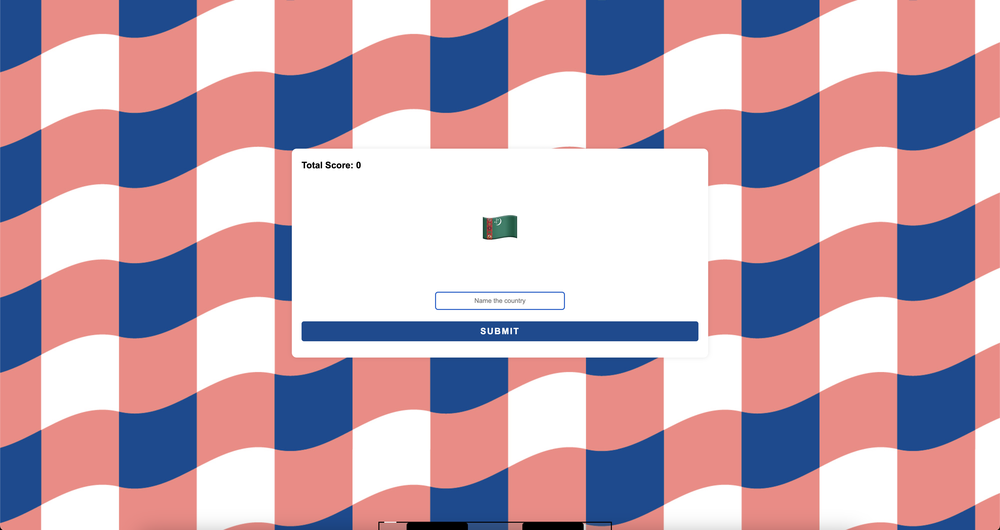

# Country Guess

[](#)
> A fun and interactive quiz game where users try to guess the country by identifying its flag. The flags are dynamically loaded from a MySQL database, ensuring a varied and engaging experience with every round.

## Overview

**Country Guess** is an interactive web-based game where players test their geography knowledge by identifying countries based on their flags. The game fetches flag data from a MySQL database and randomly selects questions for a fresh experience each round. Players receive immediate feedback on their answers, making learning engaging and fun.

## Preview

<p align="center">
  
</p>

## Features

- **Flag-Based Quiz:** Users are shown a flag and must correctly identify the corresponding country.
- **Dynamic Database Integration:** Flags and country names are stored and retrieved from a MySQL database.
- **Score Tracking:** The app keeps track of the user’s correct guesses.
- **Interactive Gameplay:** Provides instant feedback on correct and incorrect answers.

## Live Demo

**Explore the live version here:** [View Live Demo](https://marius-bogdan.com/projects/country-guess/)

## Local Setup

1. **Clone** the repository:
   ```bash
   git clone https://github.com/MIBogdan/country-guess.git
   ```
2. **Import the database:** 
- Import the `world.sql` file into MySQL. This will automatically create the `world` database and populate it with the necessary data.


3. **Ensure your MySQL credentials match the following** (as used in `index.js`):
- **Username**: `root`
- **Host**: `localhost`
- **Database**: `world`
- **Password**: (leave empty if not set)


4. **Install** dependencies:
   ```bash
   npm install
   ```

5. **Run** the application:
   ```bash
   npm start
   ```
- The development server will open automatically in your default browser.
- **If it doesn't open automatically**,manually visit: http://localhost:3000 in your browser.

6. **Terminate** the server:
- **On macOS/Linux:** Press `Control + C` in the terminal. 
- **On Windows:** Press `Ctrl + C` in the Command Prompt or PowerShell. 
---

## Author

**Marius Bogdan**  
[Personal portfolio](https://marius-bogdan.com/)

Feel free to reach out for any questions or collaborations!

## License

This project is provided for testing and demonstration purposes only. All rights are reserved. No part of this project may be redistributed, reuploaded, or used in any manner (commercially or otherwise) without explicit written permission from the author.
